# Keeper

  
| OS | Points | Difficulty | Creator |
|:-:|:-:|:-:|:-:|
| Linux | 20 | Easy | knightmare |

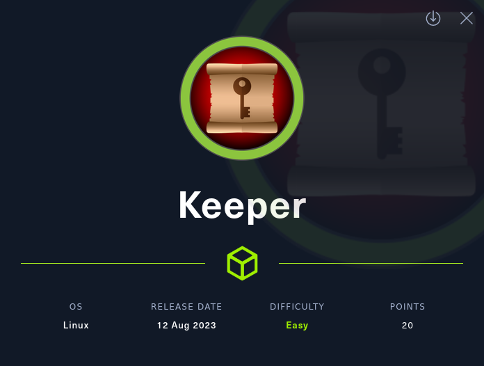
  
## Contents

1. [Fingerprinting and Scanning](#fingerprinting-and-scanning)
2. [Web Enumeration](#web-enumeration)
3. [Credential Reuse](#credential-reuse) - **User Flag**
4. [Server Enumeration](#server-enumeration)
5. [Leaking the Master Password](#leaking-the-master-password)
6. [Reading the KeePass Database](#reading-the-keepass-database)
7. [Getting the Private Key](#getting-the-private-key) - **Root Flag** 

## Fingerprinting and Scanning
  
Let's kick off our first round of recon with a quick nmap scan.  
`sudo nmap -sC -sS -sV -p- --min-rate=5000 -vvv -oN keeper.nmap 10.10.11.227`
- `-sC` - always use default scripts to find low hanging fruit.
- `--min-rate=5000` - wouldn't run this on real hosts but for HtB it speeds things up.
- `-p-` - scan the entire port range in case they have something tucked away at a non-standard port.
- `-oN` - output to a file because we should never have to run a scan twice unless the environment changes.
  
```
PORT   STATE SERVICE REASON         VERSION
22/tcp open  ssh     syn-ack ttl 63 OpenSSH 8.9p1 Ubuntu 3ubuntu0.3 (Ubuntu Linux; protocol 2.0)
| ssh-hostkey: 
|   256 35:39:d4:39:40:4b:1f:61:86:dd:7c:37:bb:4b:98:9e (ECDSA)
| ecdsa-sha2-nistp256 AAAAE2VjZHNhLXNoYTItbmlzdHAyNTYAAAAIbmlzdHAyNTYAAABBBKHZRUyrg9VQfKeHHT6CZwCwu9YkJosNSLvDmPM9EC0iMgHj7URNWV3LjJ00gWvduIq7MfXOxzbfPAqvm2ahzTc=
|   256 1a:e9:72:be:8b:b1:05:d5:ef:fe:dd:80:d8:ef:c0:66 (ED25519)
|_ssh-ed25519 AAAAC3NzaC1lZDI1NTE5AAAAIBe5w35/5klFq1zo5vISwwbYSVy1Zzy+K9ZCt0px+goO
80/tcp open  http    syn-ack ttl 63 nginx 1.18.0 (Ubuntu)
|_http-title: Site doesn't have a title (text/html).
| http-methods: 
|_  Supported Methods: GET HEAD
|_http-server-header: nginx/1.18.0 (Ubuntu)
Service Info: OS: Linux; CPE: cpe:/o:linux:linux_kernel
```
  
Only SSH and HTTP are open on this box, the SSH version running doesn't have any known vulnerabilities so the foothold for this box will be through the web application.
  
## Web Enumeration
  
Browsing to `http://10.10.11.227` tells us to use the `tickets.keeper.htb/rt` page to raise IT support tickets. I added the following line to `/etc/hosts` in order to access that subdomain:  
- `10.10.11.227    tickets.keeper.htb`  
  
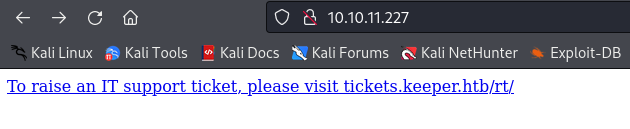
  
Browsing to `http://tickets.keeper.htb/rt` takes us to a login page. Doing a quick google search shows that this web app, Request Tracker by Best Practical, is actually a real one. Every time I see a login page, first thing I try is default creds. The default creds for this app are `root:password` and can be found in this [page](https://docs.bestpractical.com/rt/4.4.1/README.html) in the docs.  
- The [Project Raven](https://darknetdiaries.com/episode/47/) episode on Darknet Diaries has a cool story that has to do with default creds.  
  
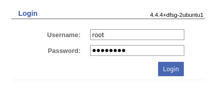
  
Now we're logged into the root account on the web application.  
  
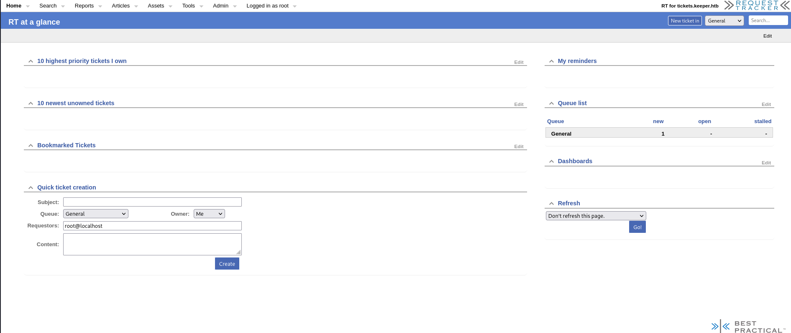
  
Since this is a real application and the version number (`4.4.4`) is included on the Login form, we can look for known exploits. Searching on exploitDB and google returned nothing so that is probably a dead end.  
  
From the documentation, I know that this web app uses php. Since we have the root user, there is good chance we have file upload capabilities. We can probably use that to upload a webshell.  
  
I didn't find file upload anywhere, but I found the 'Users' page while clicking around. It can be opened by clicking 'Admin > Users' from the top bar.  
  
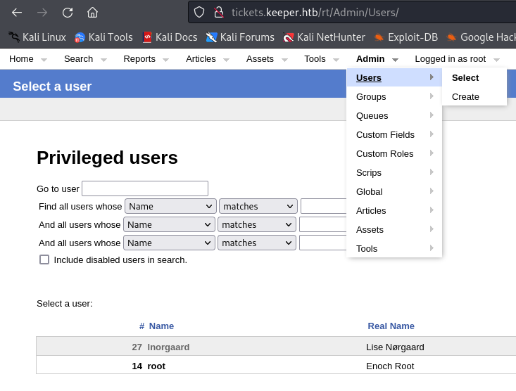
  
If we click the username of any of these users we find a user modification page. There is only one other user called `lnorgaard`.  The modification page for `lnorgaard` has the initial password set for this user in the comments field. These creds could be used for the web application still or they can be reused for ssh so I'll check both of these paths.
- creds - `lnorgaard:Welcome2023!`
  

  
## Credential Reuse

These credentials worked for the web application but this user has lower privileges than the account I already had so that doesn't help. I tried to reuse the credentials for `ssh` and it went through so this provides the initial foothold on the machine.
- `ssh lnorgaard@10.10.11.227`
- `cat user.txt`
  
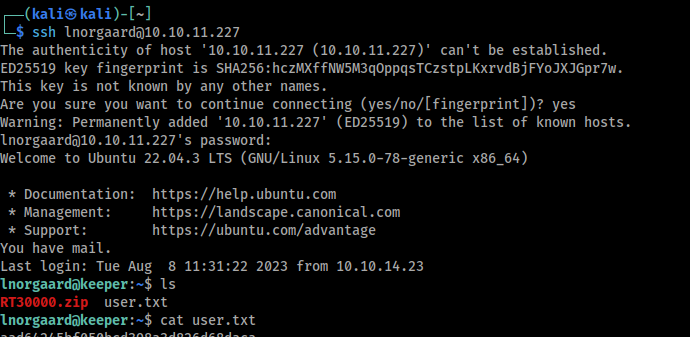
  
Tip: even though we have a password, add your public key to `.ssh/authorized_keys` for easier access with `ssh` and `scp`.  
## Server Enumeration
  
Now that I'm on the box I'll try to enumerate it to try and find a path for privilege escalation.  

In the the home directory of the current user there is another file called `RT3000.zip`. This file has a keepass database and a crash report memory dump. Keepass is a password manager and since `/etc/passwd` doesn't show any other users on this box, this is probably the path to root.   
  
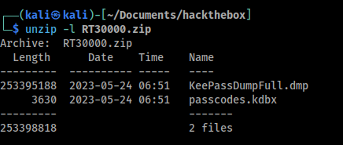
  
The KeePass database is password protected, we can extract the hash with `hash2john` and crack it but I'm holding back on that until I've exhausted my options. I'll try looking at the memory dump file first to see if there a plaintext password in there somewhere.  
  
I tried looking for a way to get the read the windows minidump file but its a pain to work with windows files on linux. After some googling I found a CVE (CVE-2023-32784) that leaks the master password from memory dumps for KeePass < 2.54. First I wanted to confirm that the version I currently have is correct.  
  
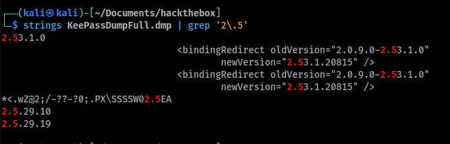
  
## Leaking the Master Password
  
The CVE PoC code can be found in [this](https://github.com/vdohney/keepass-password-dumper) repository. I just followed the instructions to get this running.
- `git clone https://github.com/vdohney/keepass-password-dumper.git`
- `pwsh`
- `cd keepass-password-dumper`
- `dotnet run ../KeePassDumpFull.dmp`
  
At first it gave me an error because the `dotnet` framework version that is pre-installed in kali did not match the target framework in the project.  
  
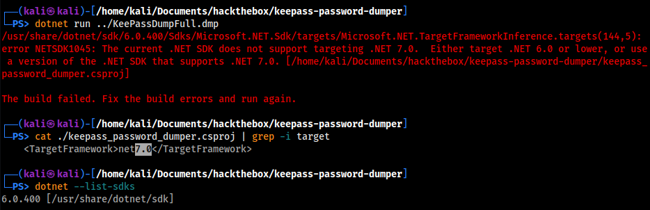
  
I just changed that 7 to a 6 in the `keepass_password_dumper.csproj` file and the PoC worked when I retried it.  
  
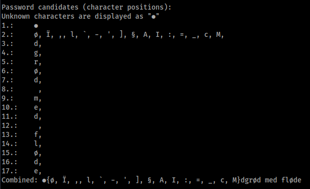
  
The exploit worked and it returned `M}dgrød med fløde`. This exploit leaks the master password except for the first two characters, in this case `M}`. These look like they are dictionary words in that language so I just looked them up in google to see what the closest phrase would be.  
  
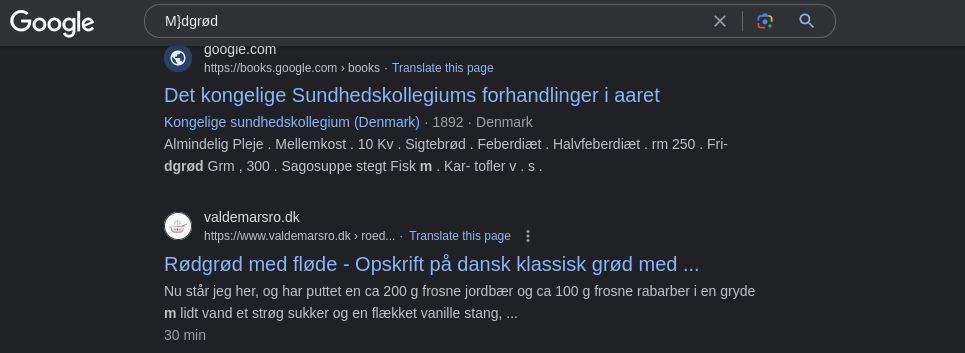
  
Looks like the master password is `rødgrød med fløde` which means "Red porridge with cream" in Danish. lol.  
  
First thing I tried is password reuse for the root account using `su root` but when are things ever that easy. (A lot of the time, actually... Just not in this case). We can read the KeePass database now so maybe the root password is in there.
  
## Reading the KeePass Database
  
To interact with the keepass database we need to install `keepass2` on kali:
- `sudo apt install keepass2`
  
To read the database we just use `keepass2 passcodes.kdbx` and enter the master password when prompted.   
  
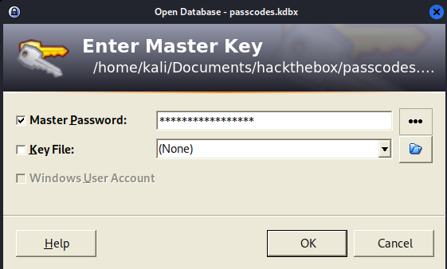
  
Now we can go to View > Configure Columns, select the password column, uncheck the "Hide data using asterisks" box to show the passwords.  
  
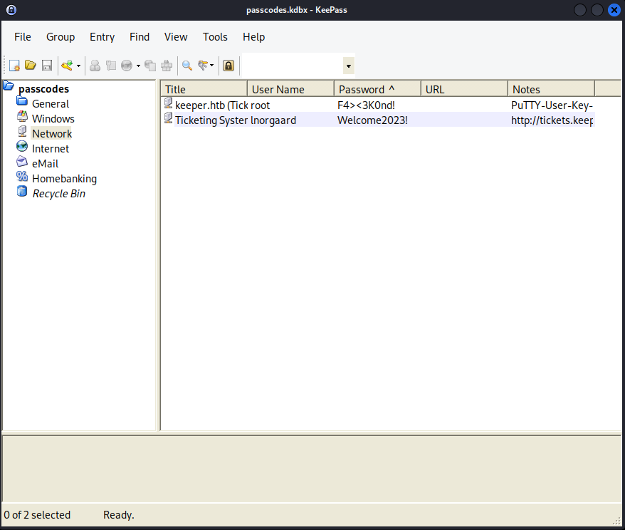
  
Seems like the root password is `F4><3K0nd!` but thats not working for `ssh`. The notes field of the record for the root user has the entire private key in there. I can probably use that to ssh as root.  
  
## Getting the Private Key
  
First I'll put the putty key in a text file.
```
echo 'PuTTY-User-Key-File-3: ssh-rsa
Encryption: none
Comment: rsa-key-20230519
Public-Lines: 6
AAAAB3NzaC1yc2EAAAADAQABAAABAQCnVqse/hMswGBRQsPsC/EwyxJvc8Wpul/D
8riCZV30ZbfEF09z0PNUn4DisesKB4x1KtqH0l8vPtRRiEzsBbn+mCpBLHBQ+81T
EHTc3ChyRYxk899PKSSqKDxUTZeFJ4FBAXqIxoJdpLHIMvh7ZyJNAy34lfcFC+LM
Cj/c6tQa2IaFfqcVJ+2bnR6UrUVRB4thmJca29JAq2p9BkdDGsiH8F8eanIBA1Tu
FVbUt2CenSUPDUAw7wIL56qC28w6q/qhm2LGOxXup6+LOjxGNNtA2zJ38P1FTfZQ
LxFVTWUKT8u8junnLk0kfnM4+bJ8g7MXLqbrtsgr5ywF6Ccxs0Et
Private-Lines: 14
AAABAQCB0dgBvETt8/UFNdG/X2hnXTPZKSzQxxkicDw6VR+1ye/t/dOS2yjbnr6j
oDni1wZdo7hTpJ5ZjdmzwxVCChNIc45cb3hXK3IYHe07psTuGgyYCSZWSGn8ZCih
kmyZTZOV9eq1D6P1uB6AXSKuwc03h97zOoyf6p+xgcYXwkp44/otK4ScF2hEputY
f7n24kvL0WlBQThsiLkKcz3/Cz7BdCkn+Lvf8iyA6VF0p14cFTM9Lsd7t/plLJzT
VkCew1DZuYnYOGQxHYW6WQ4V6rCwpsMSMLD450XJ4zfGLN8aw5KO1/TccbTgWivz
UXjcCAviPpmSXB19UG8JlTpgORyhAAAAgQD2kfhSA+/ASrc04ZIVagCge1Qq8iWs
OxG8eoCMW8DhhbvL6YKAfEvj3xeahXexlVwUOcDXO7Ti0QSV2sUw7E71cvl/ExGz
in6qyp3R4yAaV7PiMtLTgBkqs4AA3rcJZpJb01AZB8TBK91QIZGOswi3/uYrIZ1r
SsGN1FbK/meH9QAAAIEArbz8aWansqPtE+6Ye8Nq3G2R1PYhp5yXpxiE89L87NIV
09ygQ7Aec+C24TOykiwyPaOBlmMe+Nyaxss/gc7o9TnHNPFJ5iRyiXagT4E2WEEa
xHhv1PDdSrE8tB9V8ox1kxBrxAvYIZgceHRFrwPrF823PeNWLC2BNwEId0G76VkA
AACAVWJoksugJOovtA27Bamd7NRPvIa4dsMaQeXckVh19/TF8oZMDuJoiGyq6faD
AF9Z7Oehlo1Qt7oqGr8cVLbOT8aLqqbcax9nSKE67n7I5zrfoGynLzYkd3cETnGy
NNkjMjrocfmxfkvuJ7smEFMg7ZywW7CBWKGozgz67tKz9Is=
Private-MAC: b0a0fd2edf4f0e557200121aa673732c9e76750739db05adc3ab65ec34c55cb0
' > putty_key.txt
```
  
Now I need to convert this into PEM format to be able to use it from kali. I found this [guide](https://tecadmin.net/convert-ppk-to-pem-using-command/) which was pretty useful.
- `sudo apt install putty-tools`
- `puttygen putty-key.txt -O private-openssh -o priv_key`
  
Now I can use that private key to log in as root and read the flag.
  
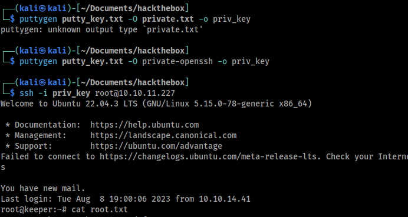

